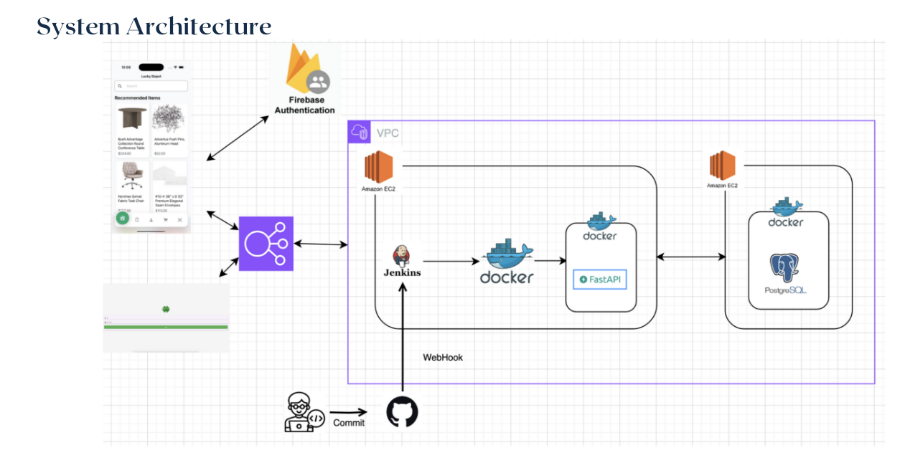
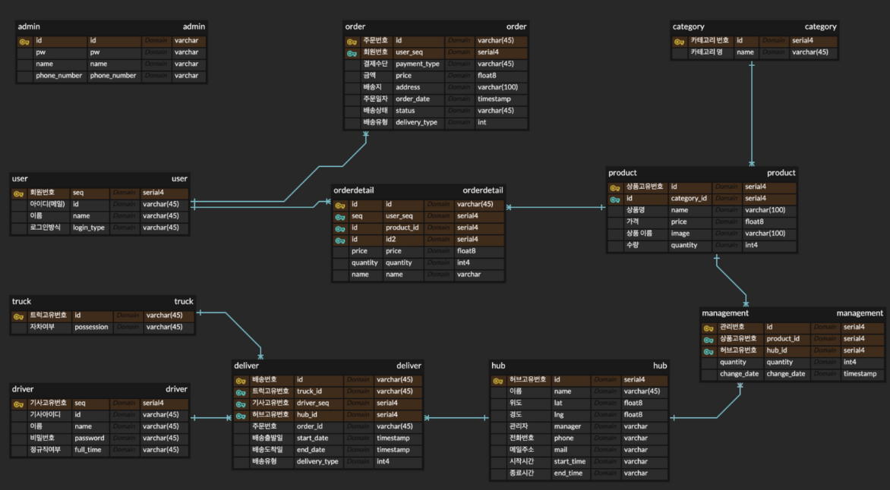
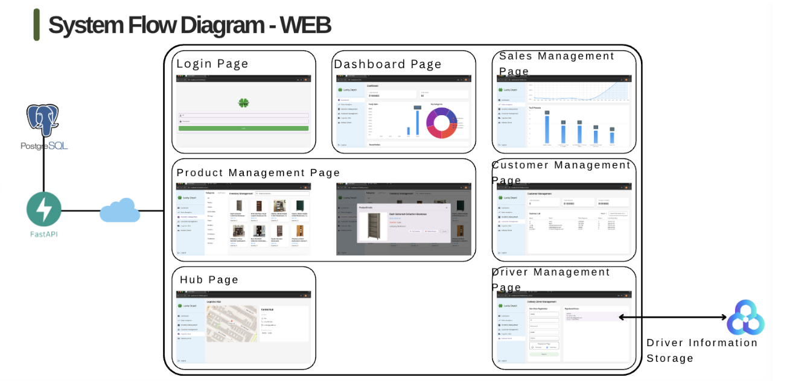
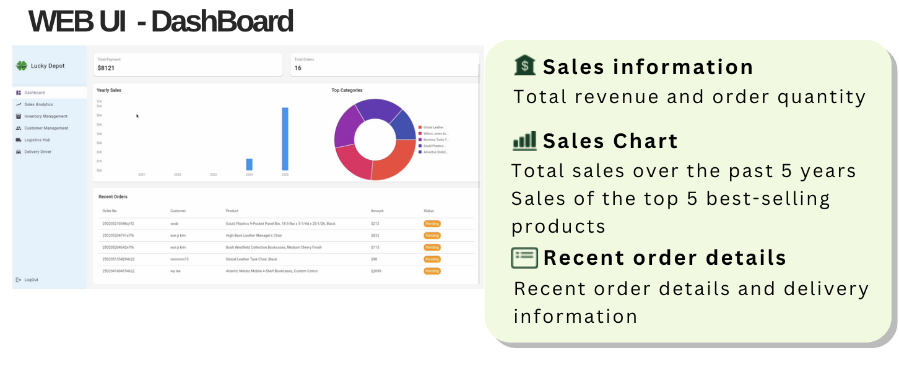
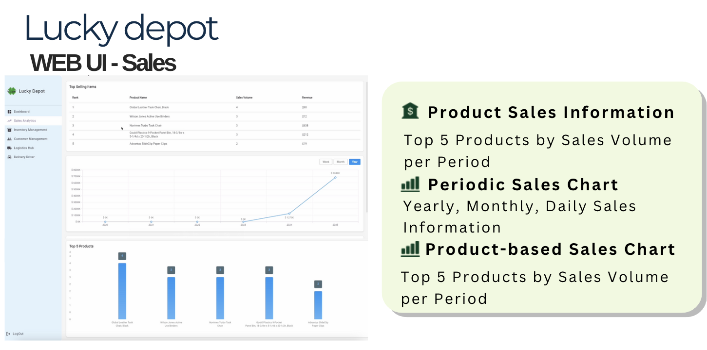
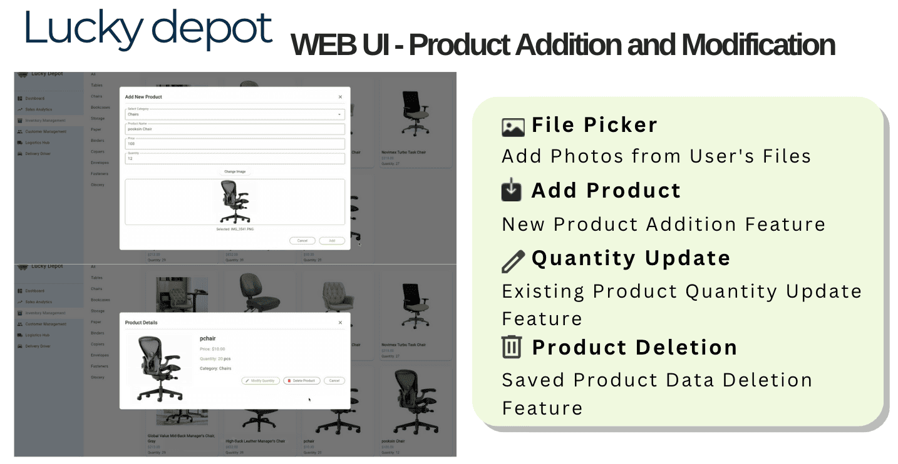
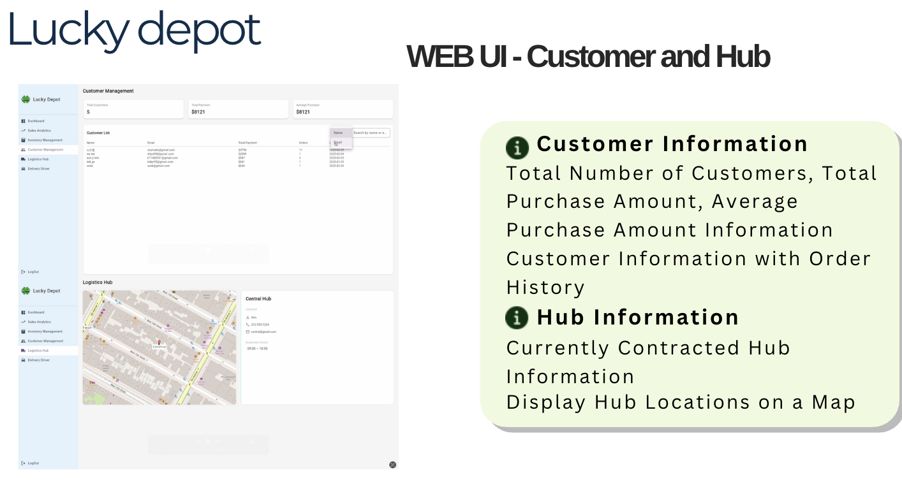
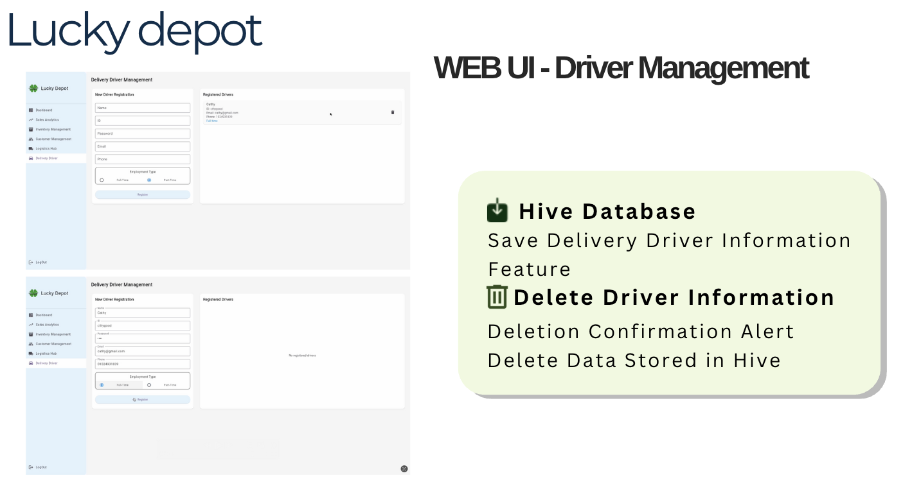

# LuckDepot

---

## Table of Contents

- [Overview](#overview)
- [Branch Structure](#Branch_Structure)
- [Demo Video](#demo-video)
- [Features](#features)
- [My Roles & Responsibilities](#my-roles--responsibilities)
- [Project Structure (MVVM)](#project-structure-mvvm)
- [Tech Stack](#tech-stack)
- [Main Packages](#main-packages)
- [System Architecture](#system-architecture)
- [Database](#database)
- [Screen Flow Diagram](#screen-flow-diagram)
- [Screenshots](#screenshots)
- [How to Run](#how-to-run)
- [Contact](#contact)

---

## Overview

Lucky Depot is a logistics management system with both a consumer app and an admin web.  
Key features include delivery date prediction, product search using images, product registration, and driver management.

- **Team Size:** 5 members  
- **Project Duration:** January 10, 2025 – February 5, 2025
  
---

## Branch Structure

- `main`: Final merge/backup branch (no actual source code)
- `yh`: Branch where I developed almost the entire admin web using Flutter and Hive (except for the login page)
- `web`: Final branch where the admin web from `yh` was merged and deployed
- Others: fastapi, angie, etc. for backend and other features

> Except for the login page, I developed all admin web features in the `yh` branch.  
> The final deliverable is available in the `web` branch.

---

## Database Structure & Execution Notice

- The main database was **PostgreSQL** running in a Docker container on a Linux server.
- **Hive** was used only for driver registration and deletion within the admin web (Flutter).
- All other major data and features relied on PostgreSQL.

> ⚠️ **Note:**  
> The Linux server and Docker environment for PostgreSQL are no longer available.  
> As a result, it is currently **not possible to run the full project or access the main database**.  
> Please refer to the demo video for actual functionality and features.

---

## Demo Video

**Links:**  
- [Demo Video](https://youtu.be/iPYmU4KXNjw)

---

## Features

- Real-time private chat and open chat rooms
- User search and friend management (add/delete/search)
- Music appreciation and sharing
- Backend powered by FastAPI & MySQL, with Firebase for chat and storage

---

## My Roles & Responsibilities

- Delivery date prediction based on location
- Product search using product images
- Admin web for product registration and management
- Driver and operational status management
- Data visualization with Syncfusion Flutter Charts

---

## Project Structure (MVVM)

This project applies the MVVM (Model-View-ViewModel) architecture for clear separation of concerns and maintainability.

- **Model (10 files):** Defines core data structures and business logic.
- **View (19 files):** Implements UI pages and reusable widgets.
- **ViewModel (9 files):** Handles state management and connects views with models.

> All files were implemented in Dart, following Flutter best practices.

---

## Tech Stack

Frameworks:

Languages:

Database:

Collaboration:

Design/Planning:

Tools:

---

## Main Packages

- `get`: Routing and state management (`^4.6.6`)
- `hive_ce`: Hive Community Edition core package (`^2.9.0`)
- `hive_ce_flutter`: Easy Hive_CE usage in Flutter (`^2.2.0`)
- `responsive_framework`: Responsive framework for Flutter web (`^1.5.1`)
- `flutter_map`: Flutter map package (`^7.0.2`)
- `latlong2`: Latitude and longitude (`^0.9.1`)
- `http`: HTTP client (`^1.2.2`)
- `file_picker`: File picker (`^8.1.7`)
- `syncfusion_flutter_charts`: Chart library (`^28.2.4+1`)
- `intl`: Internationalization (`^0.20.2`)
- `google_fonts`: Google Fonts (`^6.2.1`)
- `flutter_hooks`: Hooks for Flutter (`^0.20.5`)

---

## System Architecture

---

## Database

### EER Diagram  
_Only the EER diagram is provided; actual database dump is not included._

---

## System Flow Diagram

---

## Screenshots

### Main Screenshots (Features I Developed)

---

## How to Run

> ⚠️ The execution environment (Linux server and Docker-based PostgreSQL database) is no longer available, so it is not possible to run the project directly.
> Please refer to the demo video to see the main features and functionality.

---

## Contact

For questions, contact:  
**Terry Yoon**  
yonghyuk.terry.yoon@gmail.com
